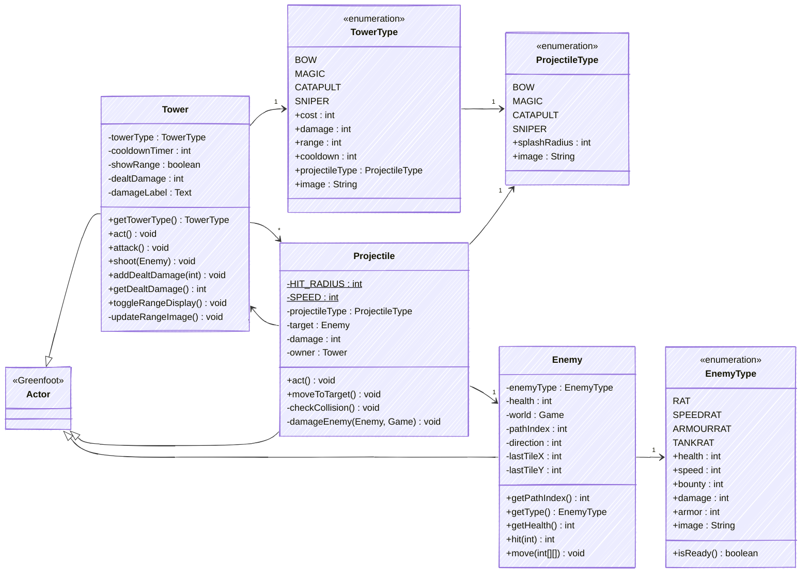
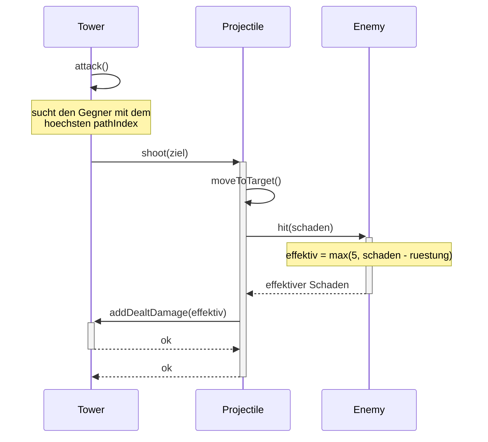
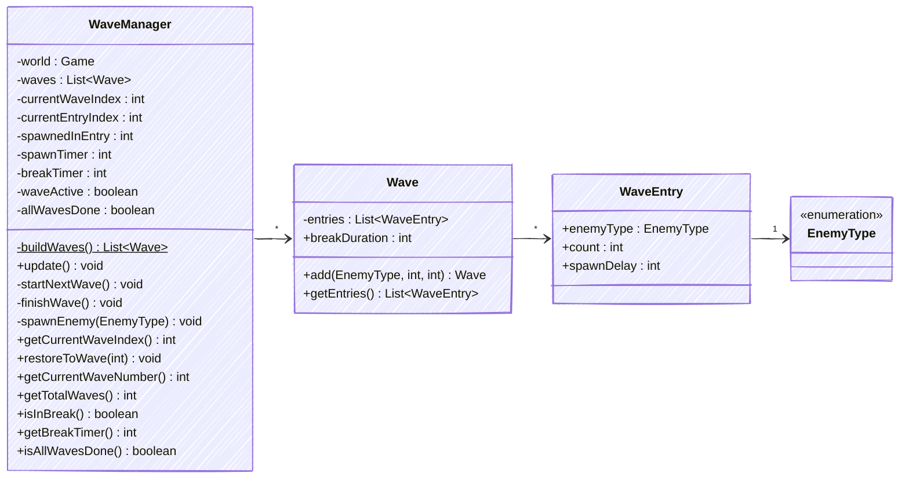
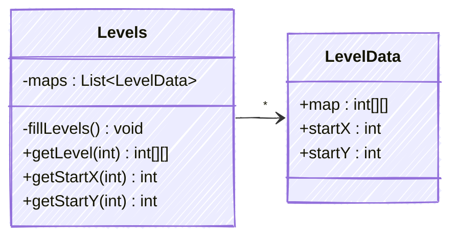
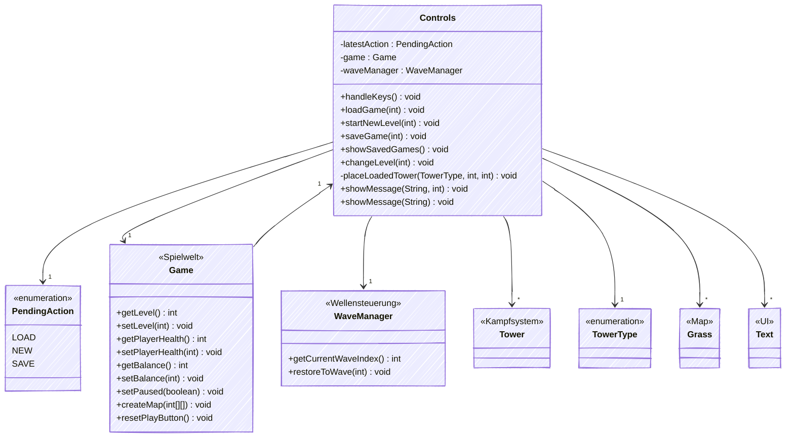
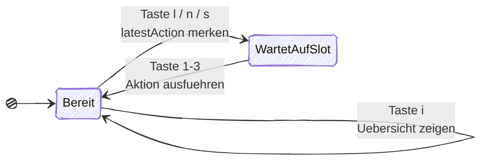
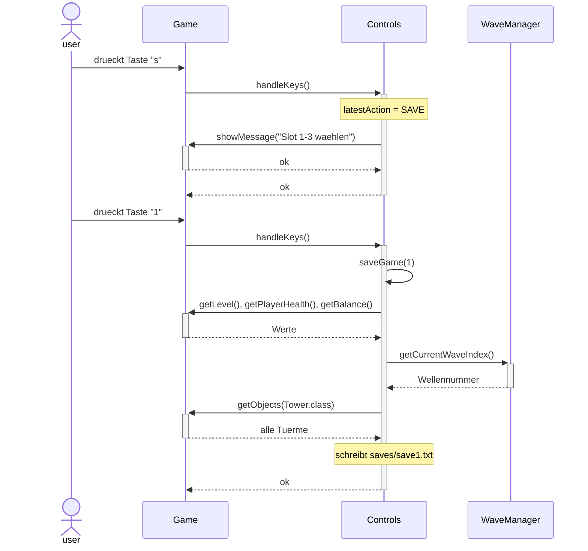

# Handbook Max

- WaveManager
- WaveEntry
- Wave
- ProjectileType
- Levels
- LevelData
- TowerType
- EnemyType
- Tower
- Projectile
- Enemy
- Controls

## Kampfsystem
### Überblick



### `Tower`
Der Turm steht auf einem Grass-Tile und beschießt Gegner in seiner Reichweite. In `act()` zählt er zuerst seinen `cooldownTimer` herunter, wenn der bei 0 ist, ruft er `attack()` auf. Dadurch schießt jeder Turm nur so schnell, wie sein `TowerType` es erlaubt.
Die Zielwahl in `attack()`: Der Turm sucht unter allen Gegnern in Reichweite den mit dem höchsten `pathIndex`, also den, der auf dem Pfad am weitesten vorne und damit dem Ziel am nächsten ist. Das ist strategisch sinnvoll, weil ein Gegner kurz vor dem Ziel gefährlicher ist als einer, der gerade erst gespawnt wurde.
Die `shoot()` Methode erzeugt dann ein `Projectile` und übergibt ihm alles Nötige: Projektiltyp, Ziel, Schaden und sich selbst als Besitzer. Über `addDealtDamage()` sammelt der Turm, wie viel Schaden er insgesamt gemacht hat was sich per Klick und `toggleRangeDisplay()` zusammen mit einem Reichweiten-Kreis anzeigen lässt.

### `TowerType`
Hält die festen Werte aller Türme:

| Typ | Kosten | Schaden | Reichweite | Cooldown | Splash |
|------|--------:|---------:|-----------:|---------:|-------:|
| BOW | 100 | 26 | 160 | 18 | – |
| MAGIC | 220 | 18 | 112 | 6 | 64 |
| CATAPULT | 400 | 60 | 128 | 38 | 96 |
| SNIPER | 600 | 120 | 224 | 60 | – |

Zusammen mit der Rüstungsformel ergibt sich folgender effektiver Schaden pro Treffer:

| Turm | RAT / SPEEDRAT (0) | ARMOURRAT (15) | TANKRAT (25) |
|------|--------------------:|---------------:|-------------:|
| BOW (26) | 26 | 11 | 5 (Minimum) |
| MAGIC (18) | 18 | 5 (Minimum) | 5 (Minimum) |
| CATAPULT (60) | 60 | 45 | 35 |
| SNIPER (120) | 120 | 105 | 95 |

Daraus ergeben sich die Rollen der Türme:

- `BOW`: Günstiger Allrounder gegen ungepanzerte Gegner.
- `MAGIC`: Räumt dank Cooldown 6 und 64 Pixel Splash ganze Gegnerschwärme ab.
- `CATAPULT`: Durchschlägt Rüstung und trifft mit 96 Pixel Splash mehrere gepanzerte Gegner gleichzeitig.
- `SNIPER`: Mit 224 Pixel Reichweite und 95 effektivem Schaden gegen TANKRAT der stärkste Einzelziel-Turm gegen Bosse und stark gepanzerte Gegner.

### `Projectile`
Ein Projektil verfolgt sein Ziel, indem `moveToTarget()` es jeden Tick zum Gegner dreht und es um `SPEED` (5 Pixel) weiterbewegt. Ist das Ziel schon tot, während das Projektil noch "in der Luft" ist, wird das Projektil aus der welt entfernt.
`checkCollision()` prüft, ob der Abstand zum Ziel unter `HIT_RADIUS` (12 Pixel) liegt. `HIT_RADIUS` beschreibt dabei die Hitbox von Gegners, also die Fläche um einen Gegner in der er verletzlich ist. Beim Einschlag entscheidet der `splashRadius` des Projektiltyps:
- `splashRadius == 0` → nur das Ziel bekommt Schaden (BOW, SNIPER)
- `splashRadius > 0` → alle Gegner im Umkreis bekommen Schaden (MAGIC, CATAPULT)
`damageEnemy()` ruft `hit()` am Gegner auf, meldet den tatsächlich verursachten Schaden an den Turm zurück und schreibt dem Spieler das Kopfgeld gut, falls der Gegner stirbt.

### `ProjectileType`
Legt für jedes Projektil nur zwei Dinge fest: den `splashRadius` (0 = Einzelziel) und das Bild. `MAGIC` hat 64, `CATAPULT` 96 Pixel Splash. Weil die Gegner in den späten Wellen nur 18–48 Pixel Abstand haben, treffen diese Projektile dort mehrere Gegner gleichzeitig, was die beiden Türme besonders effizient gegen große Massen an Gegnern macht.

### `Enemy`
Der Gegner folgt dem Pfad, der als Zahlen im Tileraster kodiert ist. `move()` liest dazu immer dann, wenn der Gegner die Mitte einer Kachel erreicht, den diesen aus und übernimmt ihn als neue Richtung. Auf einer Ziel-Kachel (14–17) entfernt sich der Gegner und der Spieler verliert ein Leben.
Nebenbei zählt `move()` den `pathIndex` hoch, also wie viele Tiles der Gegner schon gelaufen ist. Genau diesen Wert brauchen die Türme für ihre Zielwahl.
`hit()` enthält die Formel, auf der das Balancing der Typen von Enemy und Tower basiert:

```java
int effective = Math.max(5, damage - enemyType.armor);
```

Die Rüstung wird also pro Treffer vom Schaden abgezogen, wobei aber immer mindestens 5 Schaden übrig bleiben. Das wirkt nicht-linear: Ein Turm mit wenig Schaden pro Schuss verliert prozentual viel mehr als einer mit hartem Einzelschuss. Genau dadurch bekommt jeder Turmtyp seine eigene Aufgabe.

### `EnemyType`
Hält die festen Werte aller Gegner. Jeder Typ testet etwas anderes:

| Typ | Leben | Kopfgeld | Tempo | Rüstung | Rolle |
|------|------:|---------:|-------:|---------:|-------|
| RAT | 100 | 2 | 1 | 0 | Kanonenfutter |
| SPEEDRAT | 80 | 2 | 3 | 0 | Schnell, kurz in Reichweite |
| ARMOURRAT | 250 | 7 | 1 | 15 | Testet Schaden pro Schuss |
| TANKRAT | 1200 | 15 | 1 | 25 | Boss, testet Gesamtfeuerkraft | 

`isReady()` prüft, ob ein Typ ein Bild hat — Typen ohne Bild überspringt der `WaveManager`, was beim Testen des `WaveManager` praktisch ist.
Alle Gegner ziehen beim Durchkommen genau 1 Leben ab (`damage = 1`). Weil man 14 Leben hat und diese für alle 35 Wellen zusammen gelten, darf man über den kompletten Durchlauf nur 14 Gegner durchlassen.

### Ablauf eines Schusses


---

## Wellensteuerung
### Überblick



### `WaveEntry`
Die kleinste Einheit: eine Gegnergruppe. Sie speichert nur drei Werte: welcher `enemyType`, wie viele (`count`) und wie viele Ticks zwischen zwei Gegnern liegen (`spawnDelay`). Alle drei sind `public final`, weil sich eine einmal festgelegte Gruppe nie ändert.

### `Wave`
Eine Welle ist eine Liste von `WaveEntry`-Gruppen plus einer `breakDuration`, also der Pause danach. Die Methode `add()` gibt die Welle selbst zurück, sodass man mehrere Aufrufe aneinanderhängen kann:

```java
new Wave(300).add(EnemyType.TANKRAT, 2, 70)
             .add(EnemyType.RAT, 24, 15)
             .add(EnemyType.SPEEDRAT, 12, 18);
```

Das macht die Wellendefinitionen im `WaveManager` gut lesbar und man sieht auf einen Blick, woraus eine Welle besteht.

### `WaveManager`
Steuert den kompletten Ablauf. `buildWaves()` legt beim Start alle 35 Wellen an, wodurch die Schwierigkeitskurve eingestellt werden kann: von Welle 1 (10 langsame Ratten) bis zum Finale (18 Panzer, 30 Panzerratten, 40 schnelle Ratten).

`update()` läuft einmal pro Tick aus `Game.act()` und arbeitet sich durch die Zustände: Läuft eine Pause, wird `breakTimer` heruntergezählt. Läuft keine Welle, startet `startNextWave()`. Sonst wird `spawnTimer` heruntergezählt und bei 0 der nächste Gegner über `spawnEnemy()` gesetzt. Sind alle Gruppen einer Welle abgearbeitet, schließt `finishWave()` sie ab.
**Wichtig:** Die Pause startet in `finishWave()`, sobald der letzte Gegner gespawnt ist und nicht, wenn alle Gegner tot sind. Wellen können sich also überschneiden, und in den späten Wellen mit `spawnDelay` 6–7 passiert das auch. Das erhöht den Druck zum Ende hin bewusst.
`restoreToWave()` setzt den Manager auf eine bestimmte Welle zurück und wird beim Laden eines Spielstands gebraucht. Die Getter `getCurrentWaveNumber()` und `getTotalWaves()` versorgen die Wellenanzeige im Interface.

---

## `Kartenverwaltung`
### Überblick



### `LevelData`
Fasst die drei Daten zusammen, die zu einer Karte gehören: das Tileraster `map` und den Spawnpunkt `startX`/`startY`. Vorher lagen die in drei getrennten Listen, die man von Hand synchron halten musste. Jetzt gehören sie fest zusammen und können nicht mehr auseinanderlaufen.

### `Levels`
Verwaltet alle vier Karten. `fillLevels()` legt sie im Konstruktor an. Eine neue Karte kommt einfach als weiterer `maps.add(...)`-Aufruf dazu.
Die drei Getter `getLevel()`, `getStartX()` und `getStartY()` liefern die Daten über die Levelnummer, die bei 1 anfängt (intern wird `level - 1` gerechnet). `Game` holt sich damit beim Kartenaufbau das Raster, der `WaveManager` den Spawnpunkt für neue Gegner.

---

## Steuerung & Spielstände
### `Controls`
Controls ist die einzige Klasse, die auf die Tastatur reagiert, und gleichzeitig die einzige, die Dateien liest und schreibt. Sie ist bewusst keine `World` und kein `Actor` sondern ein reiner Helfer, den `Game` besitzt und einmal pro Tick über `handleKeys()` aufruft.
Der Vorteil: Alles rund um Speichern, Laden und Levelwechsel liegt an einer Stelle, statt `Game` weiter aufzublähen. `Controls` kennt dafür `Game` zurück und verändert darüber Leben, Geld und die Objekte auf dem Spielfeld.



### Bedienung
| Taste | Wirkung |
|--------|---------|
| `i` | Übersicht aller drei Spielstände anzeigen |
| `l` + `1–3` | Spielstand aus Slot 1–3 laden |
| `n` + `1–3` | Aktuelles Level neu starten (Slot 1–3) |
| `s` + `1–3` | Aktuellen Spielstand in Slot 1–3 speichern |

### Zwei-Tasten-Prinzip
Laden, Speichern und Neustart brauchen jeweils eine Slot- bzw. Levelnummer. Greenfoot liefert über `Greenfoot.getKey()` aber immer nur eine Taste pro Aufruf, weshalb man nicht „s und dann gleich 1" in einem abfragen kann.
Die Lösung ist, mit Zuständen zu Arbeiten, wobei sich `handleKeys()` die gewünschte Aktion im Feld `latestAction` merkt. Erst beim nächsten Tastendruck, wenn 1, 2 oder 3 gedrückt werden, wird die gemerkte Aktion ausgeführt und `latestAction` wird wieder auf `null` zurückgesetzt.



Die drei möglichen Aktionen stehen im privaten Enum `PendingAction` (`LOAD`, `NEW`, `SAVE`).

### Das Speicherformat
Ein Spielstand ist eine schlichte Textdatei unter saves/saveN.txt mit einem `schlüssel=wert`-Paar pro Zeile:

```text
level=2
health=11
balance=340
wave=7
tower=BOW,3,5
tower=CATAPULT,6,2
tower=SNIPER,9,4
```

Die ersten vier Zeilen sind der Spielzustand, danach folgt pro Turm eine eigene Zeile mit Typ und Kachelposition. Die Position wird als Kachel gespeichert und nicht in Pixeln, weil sie so unabhängig von `TILE_SIZE` bleibt.
Das Format ist bewusst so einfach gehalten, dass man einen Spielstand im Texteditor lesen und zum Testen auch von Hand ändern kann.

### Ablauf beim Speichern



`saveGame()` sammelt die Werte über die Getter von `Game`, holt die Wellennummer vom `WaveManager` und schreibt für jeden Turm aus `getObjects(Tower.class)` eine Zeile. Das try-with-resources schließt den `PrintWriter` automatisch, auch wenn ein Fehler auftritt.

### Die Methoden im Einzelnen
`loadGame(int slot)` läuft in drei Schritten:
1. Datei einlesen: die Werte landen zunächst nur in lokalen Variablen. Erst wenn die Datei fehlerfrei gelesen wurde, wird überhaupt etwas verändert. Bricht das Lesen ab, bleibt das laufende Spiel unangetastet.
2. Aufräumen: alle Türme, Gegner und Projektile werden entfernt. Ist das gespeicherte Level ein anderes, baut `changeLevel()` die neue Karte auf; ist es dasselbe, werden nur die Graskacheln über `setOccupied(false)` freigegeben.
3. Aufbauen: Leben, Geld und Welle werden gesetzt, danach kommt über `placeLoadedTower()` jeder gespeicherte Turm zurück auf seine Kachel.
Am Ende startet das Spiel pausiert, damit man sich erst orientieren kann.
`startNewLevel(int newLevel)` verläuft dabei ähnlich: aufräumen, Karte wechseln, Leben und Geld auf `START_HEALTH` und `START_BALANCE` zurücksetzen, Wellen auf 0.
`showSavedGames()` liest alle drei Slots und baut daraus eine mehrzeilige Übersicht. Leere Slots werden als `[LEER]` gemeldet. Die Meldung bekommt mit 300 Ticks bewusst eine längere Anzeigedauer als die Standard-120, weil man mehr Text lesen muss.
`changeLevel(int newLevel)` entfernt alle Kacheln, setzt die Levelnummer und lässt `Game` die neue Karte aus Levels aufbauen.
`placeLoadedTower(TowerType, int, int)` rechnet die Kachelposition in Pixel um und setzt den Turm. Wichtiger Unterschied zum normalen Bauen über `Grass.placeTower()`: Hier wird kein Geld abgezogen, weil der Turm schon einmal bezahlt wurde, als er gespeichert wurde. Die Kachel wird trotzdem als belegt markiert.
`showMessage(String, int)` und `showMessage(String)` blenden unten im Spiel eine Nachricht ein und entfernen dabei die vorherige, damit sich Meldungen nicht überlagern. 
